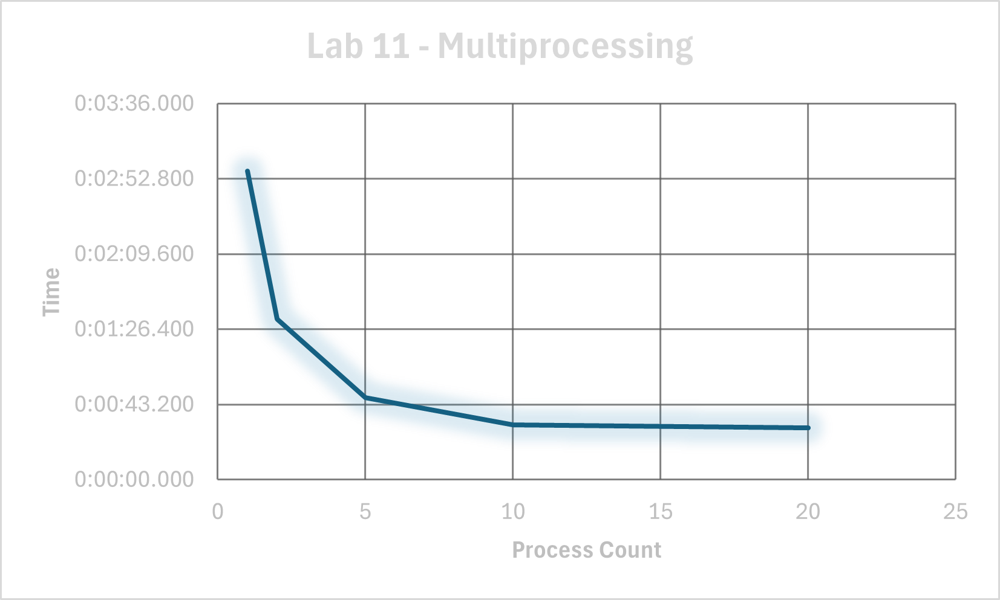

# System Programming Lab 11 Multiprocessing
CPE 2600 111

Megan Cranston

## Overview
- The user inputs the settings for the image into the command line, which includes:
  - x and y position
  - x scale (y scale calculated)
  - width and height
  - max iterations
  - num processes
  - num frames
- If no input is entered, default settings will be used
- The program then iterates over the number of frames and creates the appropriate number of processes
- Each process generates a frame and outputs it as a .jpg file

## Runtime Graph

## Results
- Using only 1 process took almost 3min to complete
- Using 10 processes reduced the time to just over 30s to complete
- Using 20 processes will continue to get slightly faster, but eventually the difference is negligible

# Systems Programming Lab 12 Multithreading
CPE 2600 111

Megan Cranston

## Overview
- The user input setting for number of threads was added to the Lab 11 code
- When a process is created, it splits the image up into sections based on the number of threads provided. 
- Each thread completes a section of the image, then merges the pieces at the end

## Performance Results

| Processes | Threads | Time     |
|-----------|---------|----------|
| 1         | 1       | 2:46.00  |
| 1         | 2       | 1:29.78  |
| 1         | 5       | 0:52.83  |
| 1         | 10      | 0:31.64  |
| 1         | 20      | 0:27.74  |
| 2         | 1       | 1:30.59  |
| 2         | 2       | 0:54.47  |
| 2         | 5       | 0:31.05  |
| 2         | 10      | 0:24.39  |
| 2         | 20      | 0:23.56  |
| 5         | 1       | 0:46.41  |
| 5         | 2       | 0:41.99  |
| 5         | 5       | 0:28.99  |
| 5         | 10      | 0:37.12  |
| 5         | 20      | 0:23.32  |
| 10        | 1       | 0:28.48  |
| 10        | 2       | 0:32.58  |
| 10        | 5       | 0:32.68  |
| 10        | 10      | 0:24.82  |
| 10        | 20      | 0:23.35  |
| 20        | 1       | 0:26.23  |
| 20        | 2       | 0:23.40  |
| 20        | 5       | 0:23.86  |
| 20        | 10      | 0:22.87  |
| 20        | 20      | 0:22.52  |

## Results
- Using only 1 process and 1 thread took almost 3min to complete
- Using 20 processes and 20 threads reduced the time to just under 30s to complete
- Using more processes and more threads will continue to get slightly faster, but eventually the difference is negligible
- Based on the results, multithreading seems to have a larger impact on runtime compared to multiprocessing, which may be due to a shared memory space between threads
- The sweet spot seems to be closer to 20 processes and 20 threads. Going beyond this number will give negligible time difference. 
